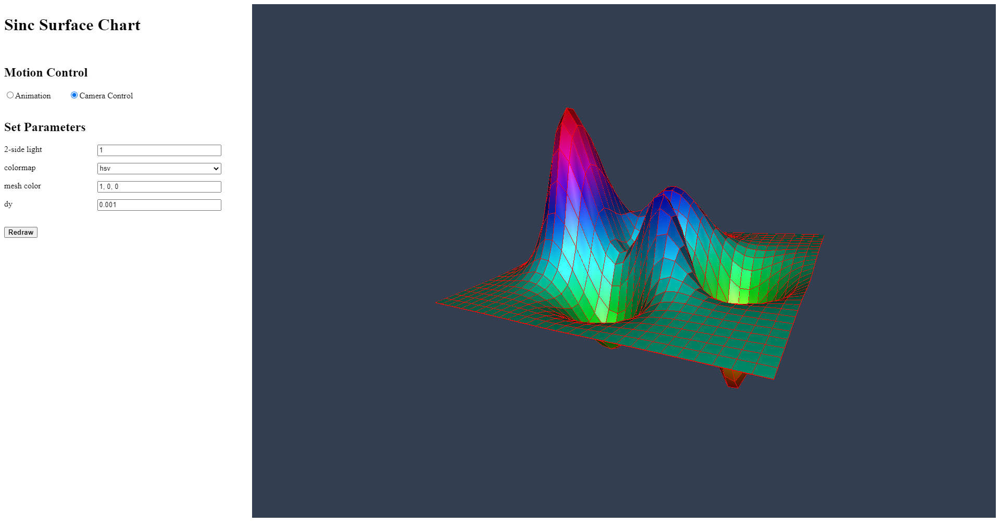

# Step-by-Step WebGPU Graphics Programming (55) 
## Create a Peaks Surface Chart Using Two Pipelines

This is the source code for the 55th part of a series YouTube videos on step-by-step WebGPU graphics programming.

This sample WebGPU app creates a 3D peaks surface chart using two pipelines. The output from the app is shown in the following image.

## Link for All Source Code Used in the WebGPU Step-By-Step Video Series:

https://github.com/jack1232/WebGPU-Step-By-Step